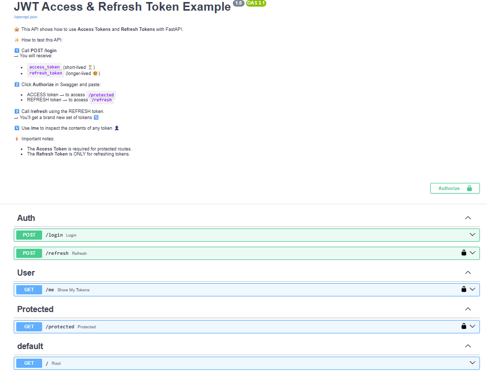

# FastAPI JWT Authentication
### Access & Refresh Tokens with Rotation (06)


## 1. General Description
This project demonstrates how to implement **JWT authentication** with **Access Tokens** and **Refresh Tokens** in a FastAPI application.  
It is designed as a **learning tutorial** to understand token-based authentication flows.

---
## 📑 Index (En)

- [Project: FastAPI JWT Auth](#project-fastapi-jwt-auth)
  - [1. General Description](#1-general-description)
  - [2.🧑‍💻 What the project does](#2-what-the-project-does)
  - [3.🔑 Key Concepts](#3-key-concepts)
  - [4.⚙️ Requirements](#4-requirements)
  - [5.✅ Installation](#5-installation)
  - [6.▶️ How to run the project](#6-how-to-run-the-project)
  - [7.🔍 Important Endpoints](#7-important-endpoints)
  - [8.⚠️ Security Details](#8-security-details)
  - [9.📘 Technical Notes](#9-technical-notes)
  - [10. License](#10-license)
- [Spanish Version](#-índice-es)
---

## 2.🧑‍💻 What the project does
- Generates **Access Tokens** (valid for 5 minutes ⏳).  
- Generates **Refresh Tokens** (valid for 1 day 🌞).  
- Allows refreshing tokens when the Access Token expires.  
- Protects routes with authentication.  
- Displays token payload information.  

## 3.🔑 Key Concepts
- **JWT (JSON Web Token):** A secure way to transmit information between parties.  
- **Access Token:** Short-lived credential used to access protected routes.  
- **Refresh Token:** Longer-lived credential used only to renew Access Tokens.  
- **Claims:** Data inside the token (e.g., user, expiration, type).  

## 4.⚙️ Requirements
- Python 3.9+  
- FastAPI  
- Uvicorn  
- python-jose  

## 5.✅ Installation
```bash
git clone <repo>
cd <repo>
pip install -r requirements.txt
```

## 6.▶️ How to run the project
```bash
uvicorn main:app --reload
```
Then open:  
- Swagger UI → `http://127.0.0.1:8000/docs`  
- Redoc → `http://127.0.0.1:8000/redoc`  

## 7.🔍 Important Endpoints
- `POST /login` → Generates Access & Refresh Tokens.  
- `POST /refresh` → Refreshes tokens using the Refresh Token.  
- `GET /protected` → Protected route (requires Access Token).  
- `GET /me` → Shows token payload.  
- `GET /` → Quick guide.  

## 8.⚠️ Security Details
- Access Tokens expire quickly to reduce risk.  
- Refresh Tokens last longer but must be stored securely.  
- Token type validation (`access` vs `refresh`).  
- Error handling for expired or invalid tokens.  
### 📌 Note on Refresh Token Rotation (EN)
In this demo, every time you call **`/refresh`**, a new **access token** and a new **refresh token** are issued.  
⚠️ Important: old refresh tokens are **not revoked** and remain valid until their expiration time.  
In production systems, refresh token rotation usually includes **revocation of old tokens**, so only the latest refresh token can be used. This prevents replay attacks if a token is stolen.

---
## 9.📘 Technical Notes
- Uses `HTTPBearer` to extract tokens from headers.  
- Differentiates tokens by `"type"` field.  
- Educational design: simple, clear, and easy to extend.  

## 10. License
[MIT License ](../LICENSE)

---

# Proyecto: FastAPI JWT Auth

## 1. Descripción General
Este proyecto demuestra cómo implementar **autenticación JWT** con **Access Tokens** y **Refresh Tokens** en una aplicación FastAPI.  
Está diseñado como un **tutorial educativo** para comprender los flujos de autenticación basados en tokens.

---
## 📑 Índice (Es)
- [Proyecto: FastAPI JWT Auth](#proyecto-fastapi-jwt-auth)
  - [1. Descripción General](#1-descripción-general)
  - [2.🧑‍💻 Qué hace el proyecto](#2-qué-hace-el-proyecto)
  - [3.🔑 Conceptos clave](#3-conceptos-clave)
  - [4.⚙️ Requisitos](#4️-requisitos)
  - [5.✅ Instalación](#5-instalación)
  - [6.▶️ Cómo correr el proyecto](#6️-cómo-correr-el-proyecto)
  - [7.🔍 Endpoints importantes](#7-endpoints-importantes)
  - [8.⚠️ Detalles de seguridad](#8️-detalles-de-seguridad)
  - [9.📘 Notas técnicas](#9-notas-técnicas)
  - [10. Licencia](#10-licencia)
-[Versión en Inglés](#-índice-es)
---

## 2.🧑‍💻 Qué hace el proyecto
- Genera **Access Tokens** (válidos por 5 minutos ⏳).  
- Genera **Refresh Tokens** (válidos por 1 día 🌞).  
- Permite refrescar tokens cuando el Access Token expira.  
- Protege rutas con autenticación.  
- Muestra la información contenida en el token.  

## 3.🔑 Conceptos clave
- **JWT (JSON Web Token):** Estándar para transmitir información segura.  
- **Access Token:** Credencial de corta duración para acceder a rutas protegidas.  
- **Refresh Token:** Credencial de larga duración para renovar el Access Token.  
- **Claims:** Datos dentro del token (ej. usuario, expiración, tipo).  

## 4.⚙️ Requisitos
- Python 3.9+  
- FastAPI  
- Uvicorn  
- python-jose  

## 5.✅ Instalación
```bash
git clone <repo>
cd <repo>
pip install -r requirements.txt
```

## 6.▶️ Cómo correr el proyecto
```bash
uvicorn main:app --reload
```
Luego abre:  
- Swagger UI → `http://127.0.0.1:8000/docs`  
- Redoc → `http://127.0.0.1:8000/redoc`  

## 7.🔍 Endpoints importantes
- `POST /login` → Genera Access y Refresh Tokens.  
- `POST /refresh` → Refresca tokens usando el Refresh Token.  
- `GET /protected` → Ruta protegida (requiere Access Token).  
- `GET /me` → Muestra el contenido del token.  
- `GET /` → Guía rápida.  

## 8.⚠️ Detalles de seguridad
- Los Access Tokens expiran rápido para reducir riesgos.  
- Los Refresh Tokens duran más, pero deben protegerse bien.  
- Validación estricta del tipo de token (`access` vs `refresh`).  
- Manejo de errores: token inválido o expirado.  
### 📌 Nota sobre la rotación de Refresh Tokens (ES)
En esta demo, cada vez que llamas a **`/refresh`**, se generan un nuevo **access token** y un nuevo **refresh token**.  
⚠️ Importante: los refresh tokens antiguos **no se invalidan** y siguen siendo válidos hasta que expiren.  
En sistemas de producción, la rotación de refresh tokens normalmente incluye la **revocación de los tokens antiguos**, de modo que solo el último refresh token pueda usarse. Esto evita ataques de repetición si un token es robado.

## 9.📘 Notas técnicas
- Se usa `HTTPBearer` para extraer el token del header.  
- Se diferencian tokens por el campo `"type"`.  
- Diseño simple y didáctico, ideal para aprender antes de usar en producción.  

## 10. Licencia
[MIT License](../LICENSE)
