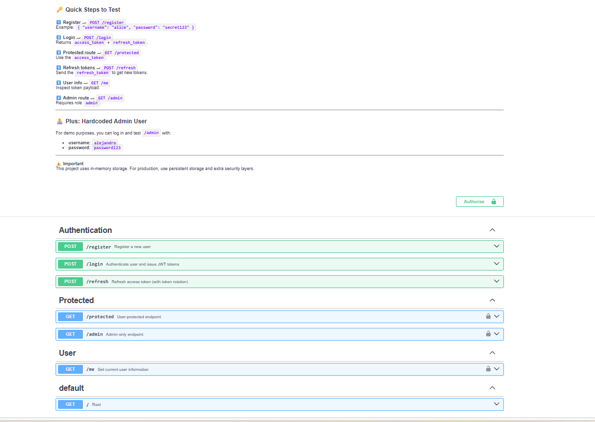

# Project: FastAPI JWT Auth

## 1. General Description

This project is a demonstration of an authentication and authorization system built with **FastAPI** using **JWT (JSON Web Tokens)**. It implements access tokens, refresh tokens, role-based authorization via scopes, and token rotation for improved security.



## 📑 Index(En)

- [Project: FastAPI JWT Auth](#project-fastapi-jwt-auth)
  - [1. General Description](#1-general-description)
  - [📑 Index(En)](#-indexen)
  - [2. 🧑‍💻 What the project does](#2--what-the-project-does)
  - [3. 🔑 Key Concepts](#3--key-concepts)
    - [JWT (JSON Web Token)](#jwt-json-web-token)
    - [Access Token](#access-token)
    - [Refresh Token](#refresh-token)
    - [Token Rotation](#token-rotation)
    - [Scopes (Authorization)](#scopes-authorization)
  - [4. ⚙️ Requirements](#4-️-requirements)
  - [5. ✅ Installation](#5--installation)
  - [6. ▶️ How to run the project](#6-️-how-to-run-the-project)
  - [7. 🔍 Important Endpoints](#7--important-endpoints)
    - [Authentication](#authentication)
    - [Protected Routes](#protected-routes)
  - [8. ⚠️ Security Details](#8-️-security-details)
  - [9. 📘 Technical Notes](#9--technical-notes)
  - [10. 📄 Additional Documentation](#10--additional-documentation)
  - [11. License](#11-license)
  
  - [Spanish Version](#proyecto-fastapi-jwt-auth-español)
  ---
## 2. 🧑‍💻 What the project does
Main features:

* User registration with password hashing (bcrypt)
* User login with JWT generation
* Access token & refresh token mechanism
* Refresh token rotation
* Role-based access control using scopes (`user`, `admin`)
* Protected endpoints

## 3. 🔑 Key Concepts

### JWT (JSON Web Token)

A compact, signed token used to securely transmit information between parties.

### Access Token

* Short-lived token
* Used to access protected routes
* Contains user identity (`sub`) and scopes

### Refresh Token

* Long-lived token
* Used to obtain new access tokens
* Stored server-side for validation

### Token Rotation

Each time a refresh token is used:

1. The old refresh token is invalidated
2. A new access token is issued
3. A new refresh token replaces the old one

This prevents replay attacks if a refresh token is compromised.

### Scopes (Authorization)

Scopes define what actions a user can perform:

* `user`: basic access
* `admin`: elevated privileges

## 4. ⚙️ Requirements

Based on the implemented modules:

```
fastapi
uvicorn
python-jose[cryptography]
python-dotenv
bcrypt
```

Python version:

```
Python 3.10+
```

## 5. ✅ Installation

1. Clone the repository
2. Create a virtual environment
3. Install dependencies:

```bash
pip install -r requirements.txt
```

4. Create a `.env` file:

```env
SECRET_KEY=your_secret_key
ALGORITHM=HS256
ACCESS_TOKEN_EXPIRE_MINUTES=15
REFRESH_TOKEN_EXPIRE_DAYS=7
```

## 6. ▶️ How to run the project

```bash
uvicorn main:app --reload
```

The API will be available at:

```
http://127.0.0.1:8000
```

## 7. 🔍 Important Endpoints

### Authentication

* `POST /register` – Register a new user
* `POST /login` – Login and receive tokens
* `POST /refresh` – Rotate refresh & access tokens

### Protected Routes

* `GET /protected` – Requires `user` scope
* `GET /admin` – Requires `admin` scope
* `GET /me` – Returns current user info

## 8. ⚠️ Security Details

* Passwords are hashed using **bcrypt**
* Access tokens have short expiration
* Refresh tokens are stored and validated server-side
* Token type validation (`access` vs `refresh`)
* Scope validation per endpoint
* Refresh token rotation enforced

## 9. 📘 Technical Notes

* In-memory database (`fake_users_db`) is used for demo purposes
* Refresh tokens are stored in `active_refresh_tokens`
* JWT payload includes a `type` field for validation
* Not intended for production without persistent storage

## 10. 📄 Additional Documentation

Detailed diagrams and technical notes are available in the [docs folder](docs/).

## 11. License

[MIT License](../LICENSE)

---

# Proyecto: FastAPI JWT Auth (Español)

## 1. Descripción General

Este proyecto demuestra un sistema de autenticación y autorización usando **FastAPI** y **JWT (JSON Web Tokens)**. Implementa tokens de acceso, refresh tokens, control de acceso por roles y rotación de tokens.

## 📑 Índice(Es)
- [Proyecto: FastAPI JWT Auth (Español)](#proyecto-fastapi-jwt-auth-español)
  - [1. Descripción General](#1-descripción-general)
  - [2. 🧑‍💻 Qué hace el proyecto](#2--qué-hace-el-proyecto)
  - [3. 🔑 Conceptos clave](#3--conceptos-clave)
    - [JWT](#jwt)
    - [Access Token](#access-token-1)
    - [Refresh Token](#refresh-token-1)
    - [Rotación de Tokens](#rotación-de-tokens)
    - [Scopes](#scopes)
  - [4. ⚙️ Requisitos](#4-️-requisitos)
  - [5. ✅ Instalación](#5--instalación)
  - [6. ▶️ Cómo correr el proyecto](#6-️-cómo-correr-el-proyecto)
  - [7. 🔍 Endpoints importantes](#7--endpoints-importantes)
  - [8. ⚠️ Detalles de seguridad](#8-️-detalles-de-seguridad)
  - [9. 📘 Notas técnicas](#9--notas-técnicas)
  - [10. 📄 Documentación Adicional](#10--documentaciòn-adicional)
  - [11. Licencia](#11-licencia)
- [Versión en Inglés](#-index-en)

## 2. 🧑‍💻 Qué hace el proyecto

Funcionalidades principales:

* Registro de usuarios con contraseñas hasheadas
* Inicio de sesión con JWT
* Access tokens y refresh tokens
* Rotación de refresh tokens
* Autorización basada en scopes
* Rutas protegidas

## 3. 🔑 Conceptos clave

### JWT

Token firmado que transporta información del usuario de forma segura.

### Access Token

* Corta duración
* Acceso a endpoints protegidos
* Incluye identidad y permisos

### Refresh Token

* Larga duración
* Permite obtener nuevos access tokens
* Validado en el servidor

### Rotación de Tokens

Cuando se usa un refresh token:

1. El token anterior se invalida
2. Se genera un nuevo access token
3. Se genera un nuevo refresh token

Esto reduce el riesgo si un token es robado.

### Scopes

Definen permisos:

* `user`: acceso básico
* `admin`: permisos avanzados

## 4. ⚙️ Requisitos

Dependencias según los módulos implementados:

```
fastapi
uvicorn
python-jose[cryptography]
python-dotenv
bcrypt
```

Python 3.10+

## 5. ✅ Instalación

```bash
pip install -r requirements.txt
```

Configurar variables de entorno en `.env`.

## 6. ▶️ Cómo correr el proyecto

```bash
uvicorn main:app --reload
```

## 7. 🔍 Endpoints importantes

* `/register`
* `/login`
* `/refresh`
* `/protected`
* `/admin`
* `/me`

## 8. ⚠️ Detalles de seguridad

* Hashing con bcrypt
* Expiración de access tokens
* Validación de tipo de token
* Scopes por endpoint
* Rotación de refresh tokens

## 9. 📘 Notas técnicas

* Base de datos en memoria (demo)
* Refresh tokens activos en memoria
* No apto para producción sin persistencia

## 10. 📄 Documentaciòn Adicional 
Diagramas detallados y notas técnicas están disponibles en el [docs folder](docs/).


## 11. Licencia

[Licencia MIT](../LICENSE)
