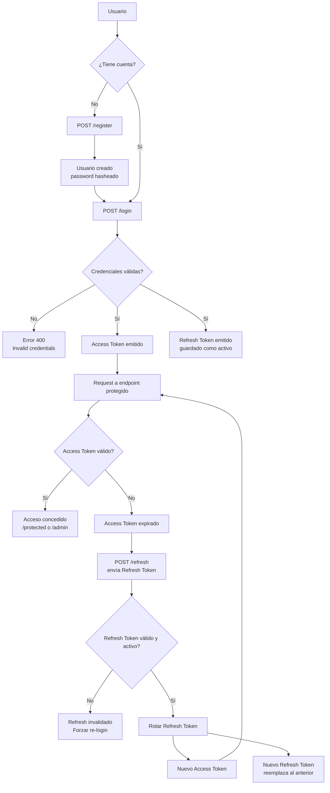

### 🔐 JWT Authentication Flow

The following diagram illustrates how access tokens, refresh tokens,
and token rotation work in this project:

```mermaid
flowchart TD
    A[Usuario] --> B{¿Tiene cuenta?}
    B -->|No| C[POST /register]
    C --> D[Usuario creado<br/>password hasheado]
    D --> E[POST /login]
    B -->|Sí| E[POST /login]

    E --> F{Credenciales válidas?}
    F -->|No| X[Error 400<br/>Invalid credentials]
    F -->|Sí| G[Access Token emitido]
    F -->|Sí| H[Refresh Token emitido<br/>guardado como activo]

    G --> I[Request a endpoint protegido]
    I --> J{Access Token válido?}

    J -->|Sí| K[Acceso concedido<br/>/protected o /admin]
    J -->|No| L[Access Token expirado]

    L --> M[POST /refresh<br/>envía Refresh Token]
    M --> N{Refresh Token válido y activo?}

    N -->|No| O[Refresh invalidado<br/>Forzar re-login]
    N -->|Sí| P[Rotar Refresh Token]
    P --> Q[Nuevo Access Token]
    P --> R[Nuevo Refresh Token<br/>reemplaza al anterior]

    Q --> I

```
